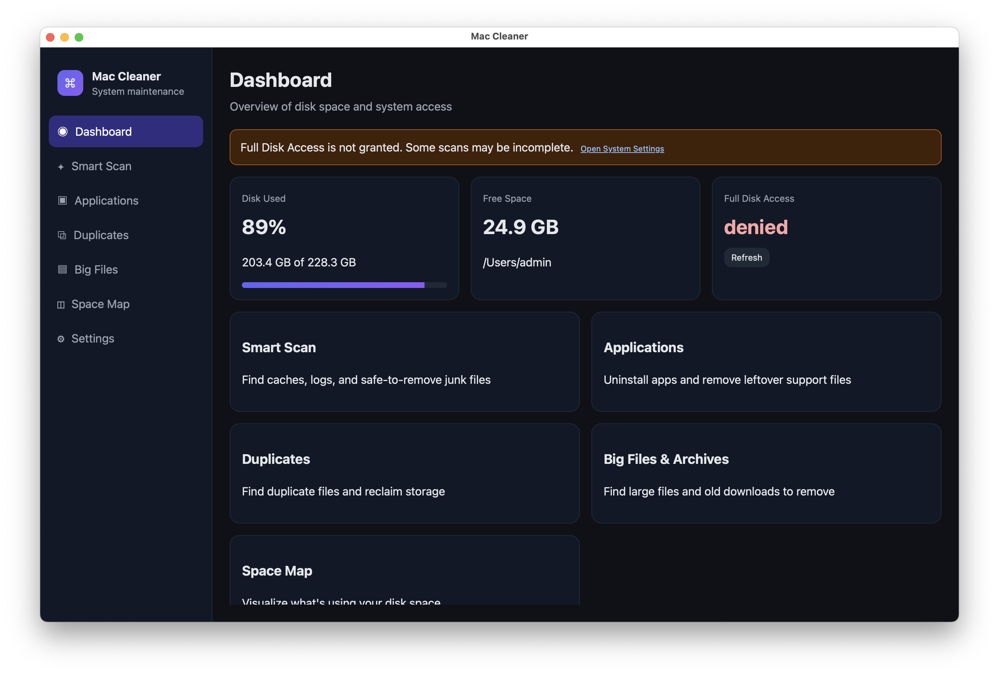
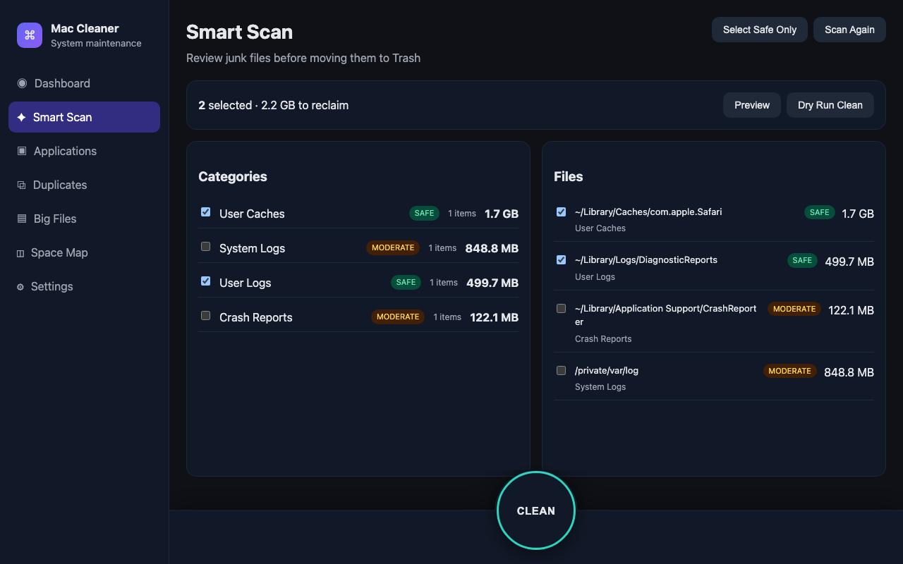
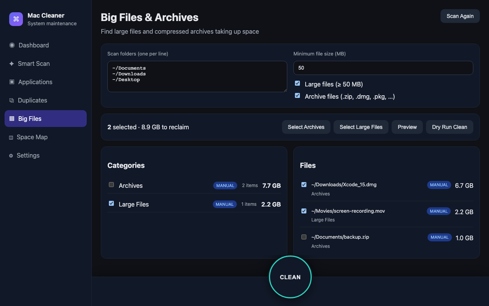
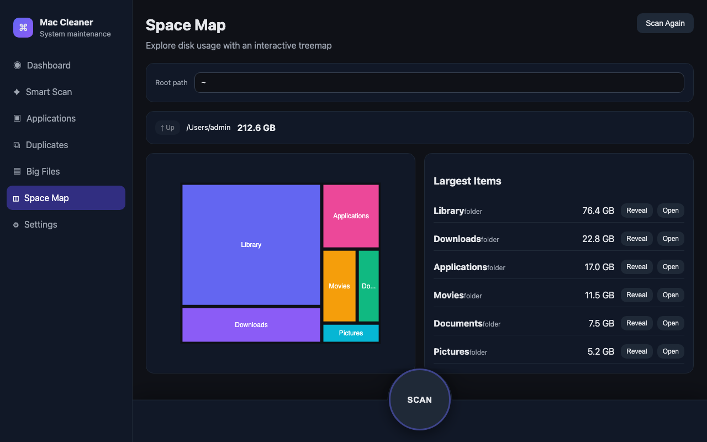

# Mac Cleaner

A macOS desktop maintenance app built with Go (Wails) and React. Scans junk files, finds large files and archives, uninstalls apps with leftovers, detects duplicates, and visualizes disk usage.

## Download

**[Download the latest release (DMG)](https://github.com/truong512/mac-cleaner/releases/latest)** — macOS 12+

Release assets are built with [GoReleaser](.goreleaser.yaml):

- **Apple Silicon:** `mac-cleaner-<version>-darwin-arm64.dmg`
- **Intel:** `mac-cleaner-<version>-darwin-amd64.dmg`

**Install:** open the DMG, drag **Mac Cleaner** to Applications, then launch from Applications. If macOS blocks the app, allow it under **System Settings → Privacy & Security** (signed/notarized builds avoid this).

To build from source instead, see [Development](#development).

## Screenshots

**Dashboard** — disk overview and quick links:



**Smart Scan**, **Big Files**, and **Space Map**:

**Smart Scan**



**Big Files**



**Space Map**



## Features

- **Dashboard** — Disk usage summary, Full Disk Access status, and quick links to each tool
- **Smart Scan** — YAML catalog-driven junk detection with risk tiers (`safe` → `manual`), category toggles, preview-before-delete, and “select safe only”
- **Applications** — List third-party apps, scan Library leftovers, uninstall bundles, and unload matching LaunchAgents when removing plists
- **Duplicates** — BLAKE3-based duplicate finder with keeper selection
- **Big Files** — Scan configurable roots for files above a size threshold and/or archive types (zip, dmg, pkg, etc.), with bulk trash cleanup
- **Space Map** — Interactive ECharts treemap with drill-down, top-files list, and Reveal in Finder
- **Safety** — Trash-first deletions (via Finder Trash), dry-run default, trash confirmation dialog, JSON audit log, and path exclude globs in Settings

## Requirements

- macOS 12+
- Go 1.25+
- Node.js 18+
- [Wails CLI v2](https://wails.io/docs/gettingstarted/installation)

## Development

```bash
# Install frontend deps
cd frontend && npm install && cd ..

# Live development (hot reload)
wails dev

# Production build
wails build
```

The production binary embeds `frontend/dist`. Run `cd frontend && npm run build` before `wails build` if you change the UI outside `wails dev`.

### Tests

```bash
go test ./...
```

## CLI (debug)

Headless junk scan against the embedded catalog:

```bash
go run ./cmd/maccleaner-cli
go run ./cmd/maccleaner-cli --dry-run
```

## Permissions

For complete filesystem scans, grant **Full Disk Access** in System Settings → Privacy & Security. The app works without FDA but may skip protected folders. Use **Settings** (or the Dashboard warning) to open FDA settings and refresh status.

## Audit log

Deletion and cleanup actions are appended to:

`~/Library/Logs/mac-cleaner/audit.log`

The path is shown on the Settings page.

## Distribution (signing & notarization)

[GoReleaser](https://goreleaser.com/) is configured in `.goreleaser.yaml` (darwin arm64/amd64, DMG archives). Set `MACOS_SIGN_IDENTITY` to your Developer ID Application certificate name for post-build codesigning.

Manual signing example:

```bash
codesign --deep --force --options runtime --sign "Developer ID Application: Your Name" build/bin/mac-cleaner.app
xcrun notarytool submit mac-cleaner.dmg --apple-id ... --team-id ... --password ...
xcrun stapler staple mac-cleaner.dmg
```

## Manual test checklist

- [ ] Dashboard shows disk summary and FDA status
- [ ] Smart Scan finds junk and respects risk tiers
- [ ] Dry-run cleanup does not delete files
- [ ] Trash cleanup moves files to Finder Trash (with confirmation when enabled)
- [ ] Big Files scan finds large files/archives in chosen roots
- [ ] App uninstall removes bundle + selected leftovers
- [ ] Duplicate scan finds known duplicate set
- [ ] Space Map treemap drills down and reveals in Finder
- [ ] Cancel stops long-running scans and trash operations
- [ ] Settings persist dry-run default, exclude globs, and big-files minimum size
- [ ] Audit log records cleanup actions

## Project structure

```
mac-cleaner/
├── main.go, app.go              # Wails entry + method bindings
├── internal/
│   ├── service/                 # App facade (settings, scans, events)
│   ├── catalog/                 # Embedded catalog.yaml + loader
│   ├── scan/                    # Junk scan engine
│   ├── bigfiles/                # Large file & archive scanner
│   ├── app/                     # Installed app discovery & leftovers
│   ├── duplicate/               # BLAKE3 duplicate finder
│   ├── disk/                    # Disk tree / space map
│   ├── delete/                  # Trash, bulk delete, audit log
│   ├── permission/              # Full Disk Access checks
│   ├── launchd/                 # LaunchAgent unload on uninstall
│   └── model/                   # Shared types
├── frontend/                    # React + TypeScript + Vite UI
│   └── src/pages/               # Dashboard, Junk, Apps, Duplicates, Big Files, Disk, Settings
└── cmd/maccleaner-cli/          # Optional headless junk scan
```

## License

MIT
